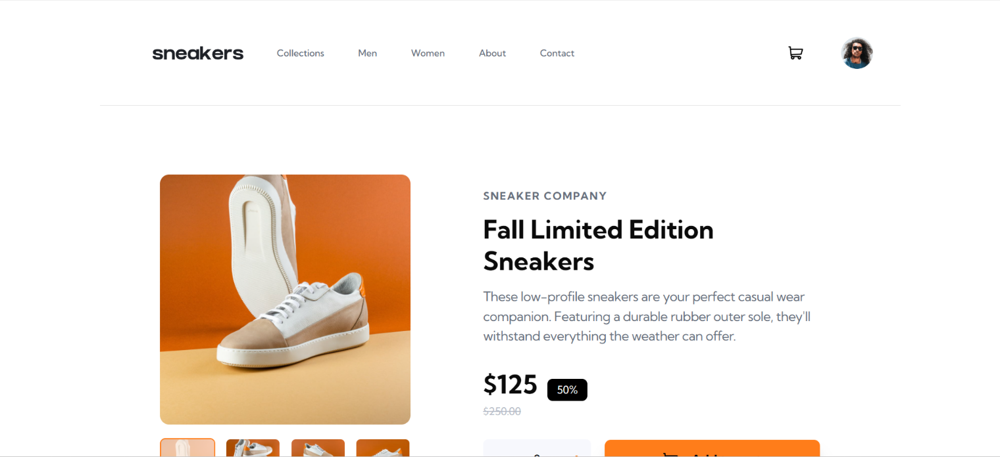
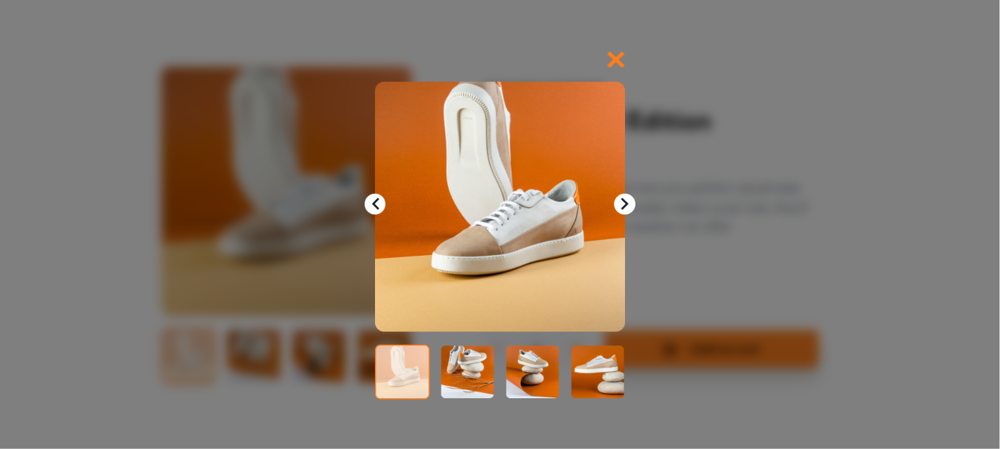

# E-commerce Product Page

A solution to the Frontend Mentor **E-commerce Product Page** challenge. This project focuses on building a responsive product page with interactive image lightbox gallery, a shopping cart, and polished UI animations.

## 📸 Screenshots

 

## ✨ Features

- Responsive layout for mobile, tablet, and desktop
- Image carousel for mobile devices
- Desktop product gallery with thumbnails
- Interactive image lightbox
- Previous and next image navigation
- Thumbnail image selection
- Shopping cart functionality
- Add products to cart
- Update product quantity
- Remove items from cart
- Animated desktop navigation underline
- Interactive 3D image tilt effect on hover
- Hover animations and smooth transitions
- Fully responsive design with fluid typography
- Accessible UI components

## 🛠️ Built With

- React
- Vite
- Tailwind CSS v4
- shadcn/ui
- zustand

## 🔗 Live Demo

https://react-fm-eight.vercel.app/

## 💻 Run Locally

git clone https://github.com/Shashank-993/React-FM/tree/main/ecommerce-cart

pnpm install

pnpm dev

## 👨‍💻 Author

Frontend Mentor Challenge completed by **Shashank Mengar**.
