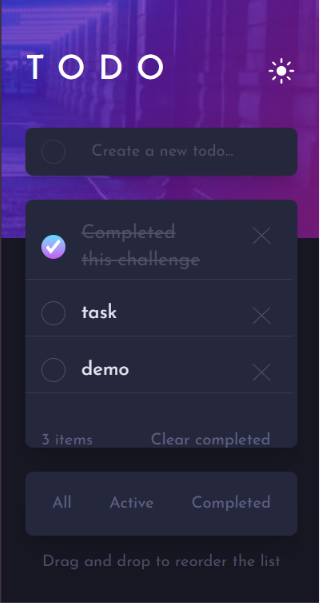
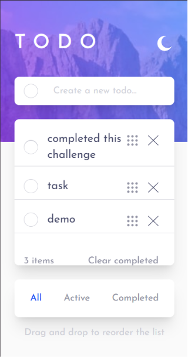
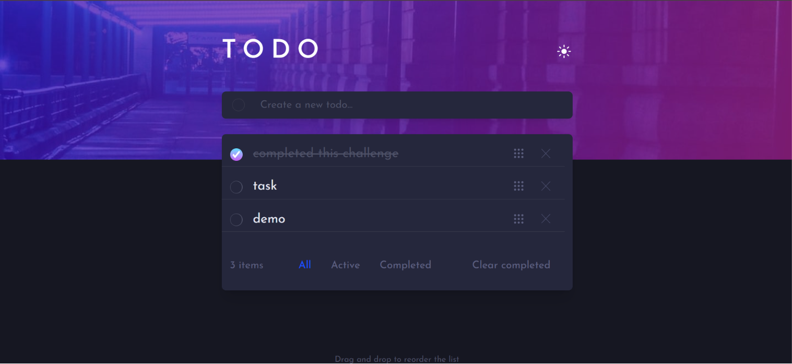
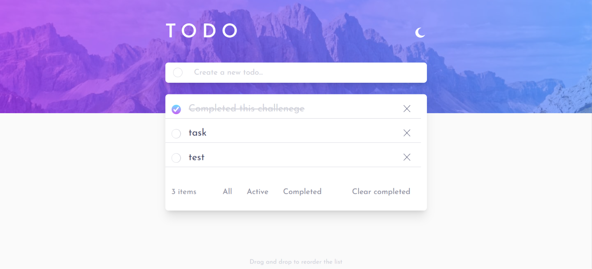

# Todo App

A responsive Todo application built as part of the Frontend Mentor challenge to practice modern frontend development with React.

## 📸 Screenshots

- mobile design
  
  
- desktop design
  
  

## ✨ Features

- Add todos
- Remove todos
- Mark todos as completed
- Clear completed todos
- Filter todos by **All**, **Active**, and **Completed**
- Fully responsive design with fluid typography
- Light and Dark mode
- Toast notifications

### Core Feature

- Drag and drop to reorder the todo list

## 🛠️ Tech Stack

- React
- JavaScript
- Context API with `useReducer`
- Tailwind CSS
- shadcn/ui
- Component-driven architecture
- Responsive Web Design

## 📂 Installation

```bash
pnpm install
pnpm dev
```

## 👨‍💻 Author

**Shashank Mengar**
